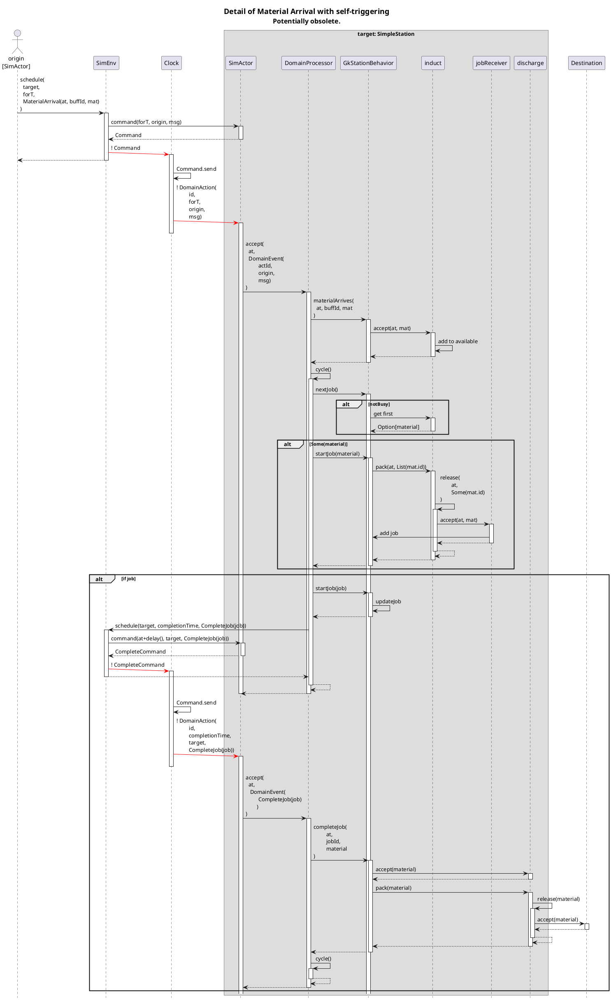
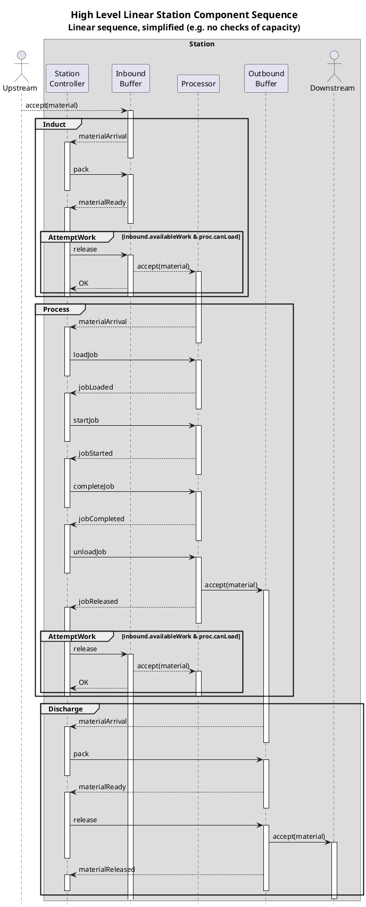

## Integration with Protocol Handling (Actor messages.)

```plantuml
@startuml
hide footbox

title
= Detail of Material Arrival with self-triggering
== Potentially obsolete.
end title

actor "origin\n[SimActor]" as Origin
participant SimEnv
participant Clock
box "target: SimpleStation"
participant SimActor
participant DomainProcessor
participant GkStationBehavior
participant induct
participant jobReceiver
participant discharge
endbox
participant Destination

Origin -> SimEnv++: schedule(\n  target,\n  forT,\n  MaterialArrival(at, buffId, mat)\n)
SimEnv -> SimActor++: command(forT, origin, msg)
return Command
SimEnv [#red]->(5) Clock++: ! Command
SimEnv --> Origin
SimEnv--
Clock -> Clock: Command.send
Clock [#red]->(5) SimActor++: ! DomainAction(\n\t id,\n\t forT,\n\t origin,\n\t msg)
Clock--
SimActor -> DomainProcessor++: accept(\n  at,\n  DomainEvent(\n\t actId,\n\t origin,\n\t msg)\n)
  DomainProcessor -> GkStationBehavior++: materialArrives(\n  at, buffId, mat\n)
    GkStationBehavior -> induct++: accept(at, mat)
    induct -> induct: add to available
    return
  return
  DomainProcessor -> DomainProcessor++: cycle()
  DomainProcessor -> GkStationBehavior++: nextJob()
    alt notBusy
      GkStationBehavior -> induct++: get first
      return Option[material]
    end
  alt Some(material)
    DomainProcessor -> GkStationBehavior++: startJob(material)
      GkStationBehavior -> induct++: pack(at, List(mat.id))
        induct -> induct++: release(\n\tat,\n\tSome(mat.id)\n)
          induct -> jobReceiver++: accept(at, mat)
            jobReceiver -> GkStationBehavior: add job
          return
        return
      return
    return
  end
  alt if job
    DomainProcessor -> GkStationBehavior++: startJob(job)
      GkStationBehavior -> GkStationBehavior: updateJob
    return
    DomainProcessor -> SimEnv++: schedule(target, completionTime, CompleteJob(job))
      SimEnv -> SimActor++: command(at+delay(), target, CompleteJob(job))
      return CompleteCommand
      SimEnv [#red]->(5) Clock++: ! CompleteCommand
    SimEnv --> DomainProcessor
    SimEnv--
    DomainProcessor --> DomainProcessor--
    DomainProcessor --> SimActor--

    SimActor--
    Clock -> Clock: Command.send
      Clock [#red]->(5) SimActor++: ! DomainAction(\n\t id,\n\t completionTime,\n\t target,\n\t CompleteJob(job))
    Clock--
    SimActor -> DomainProcessor++: accept(\n  at,\n   DomainEvent(\n\t CompleteJob(job)\n\t)\n)
      DomainProcessor -> GkStationBehavior++: completeJob(\n\t at,\n\t jobId,\n\t material\n)
        GkStationBehavior -> discharge++: accept(material)
        return
        GkStationBehavior -> discharge++: pack(material)
          discharge -> discharge++: release(material)
            discharge -> Destination++: accept(material)
            return
          return
        return
      return
      DomainProcessor -> DomainProcessor++: cycle()
      return
    return
  end
@enduml
```

## High Level Station Component Interactions

## Direct Transit

```plantuml
@startuml
hide footbox

title
= High Level Linear Station Component Sequence
== Linear sequence, simplified (e.g. no checks of capacity)
end title

actor Upstream
box Station
participant "Station\nController" as sc
participant "Inbound\nBuffer" as ib
participant "Processor" as proc
participant "Outbound\nBuffer" as ob
actor Downstream
end box


Upstream --> ib++: accept(material)
group Induct
ib --> sc++: materialArrival
ib--
sc -> ib++: pack
sc--
ib --> sc++: materialReady
ib--
  group AttemptWork [inbound.availableWork & proc.canLoad]
    sc -> ib++: release
    ib --> proc++: accept(material)
    ib --> sc: OK
  end group
  ib--
  sc--
end group

group Process
proc --> sc++: materialArrival
proc--
sc -> proc++: loadJob
sc--
proc --> sc++: jobLoaded
proc--
sc -> proc++: startJob
sc--
proc --> sc++: jobStarted
proc--
sc -> proc++: completeJob
sc--
proc --> sc++: jobCompleted
proc--
sc -> proc++: unloadJob
sc--
proc -> ob++: accept(material)
proc --> sc++: jobReleased
proc--
  group AttemptWork [inbound.availableWork & proc.canLoad]
    sc -> ib++: release
    ib --> proc++: accept(material)
    ib --> sc: OK
  end group
proc--
sc--
end group

group Discharge
ob --> sc++: materialArrival
ob--
sc -> ob++: pack
sc--
ob --> sc++: materialReady
ob--
sc -> ob++: release
ob -> Downstream++: accept(material)
sc--
ob --> sc++: materialReleased
ob--
sc--
end Discharge
Downstream--

@enduml
```
