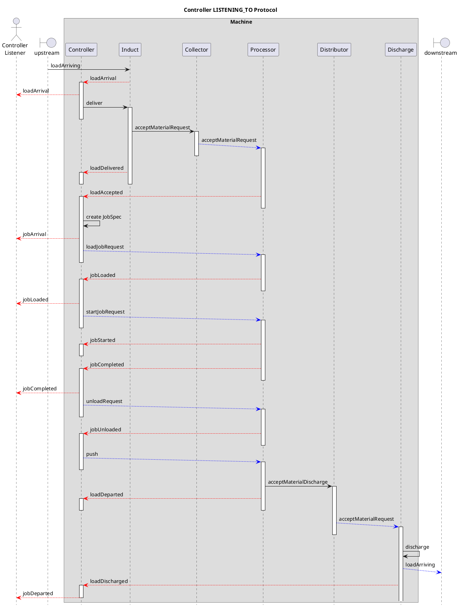

## Controller Listening-to protocol

```plantuml
@startuml

hide footbox

title
Controller LISTENING_TO Protocol
end title

actor "Controller\nListener" as Listener

boundary upstream

box Machine
participant Controller

participant Induct

participant Collector

participant Processor

participant Distributor


participant Discharge
end box

boundary downstream

upstream -> Induct: loadArriving

Induct -[#red]-> Controller++: loadArrival
Controller -[#red]-> Listener: loadArrival
Controller -> Induct++: deliver
Controller--

Induct -> Collector++: acceptMaterialRequest
Collector -[#blue]->(10) Processor++: acceptMaterialRequest
Collector--
Induct -[#red]-> Controller++: loadDelivered
Controller--
Induct--

Processor -[#red]-> Controller++: loadAccepted
Processor--
Controller -> Controller: create JobSpec
Controller -[#red]-> Listener: jobArrival
Controller -[#blue]->(10) Processor++: loadJobRequest
Controller--

Processor -[#red]-> Controller++: jobLoaded
Processor--
Controller -[#red]-> Listener: jobLoaded
Controller -[#blue]->(10) Processor++: startJobRequest
Controller--

Processor -[#red]-> Controller++: jobStarted
Controller--

Processor -[#red]-> Controller++: jobCompleted
Processor--

Controller -[#red]-> Listener: jobCompleted
Controller -[#blue]->(10) Processor++: unloadRequest
Controller--

Processor -[#red]-> Controller++: jobUnloaded
Processor--
Controller -[#blue]->(10) Processor++: push
Controller--
Processor -> Distributor++: acceptMaterialDischarge
Processor -[#red]-> Controller++: loadDeparted
Processor--
Controller--
Distributor -[#blue]->(10) Discharge++: acceptMaterialRequest
Distributor--

Discharge -> Discharge: discharge
Discharge -[#blue]->(10) downstream: loadArriving
Discharge -[#red]-> Controller++: loadDischarged
Controller -[#red]-> Listener: jobDeparted
Controller--


@enduml
```
